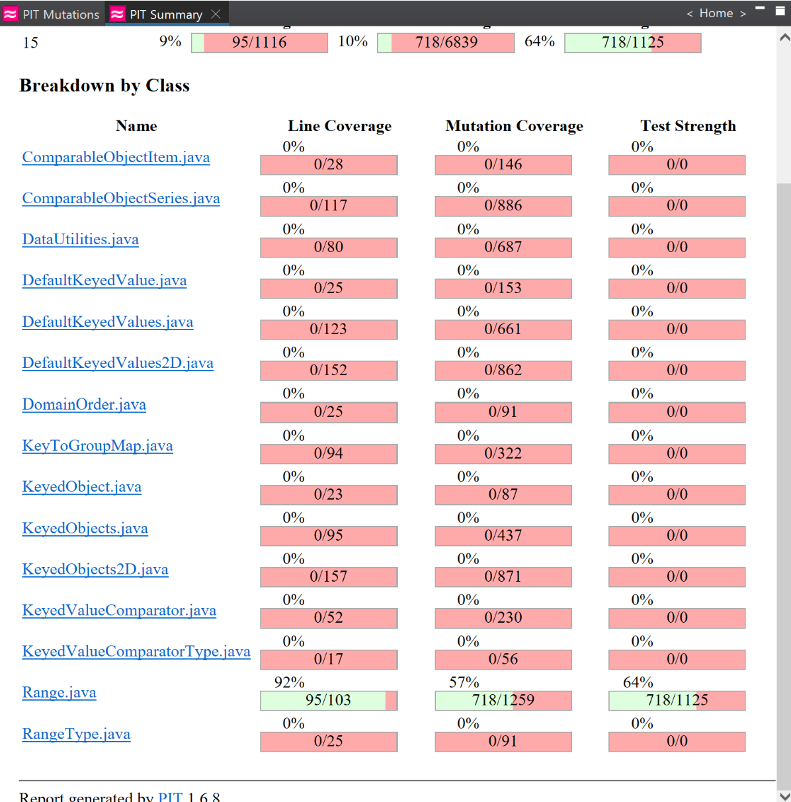
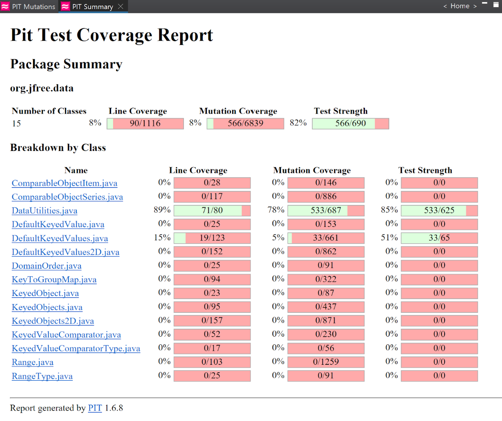
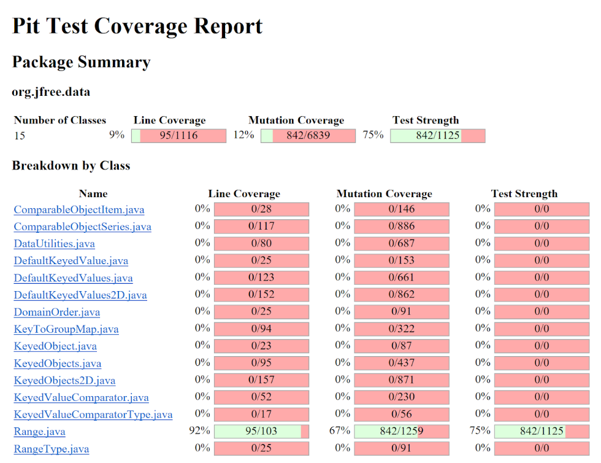

**SENG 438 - Software Testing, Reliability, and Quality**

**Lab. Report \#4 – Mutation Testing and Web app testing**
| Group \#: 13     |  |
| -------------- | --- |
| Student Names: |     |
| Tien Dat Johny Do         |     |
| Tommy Dinh              |     |
| Stuart Johnstone               |     |
| Sina Tavakol Moghaddam              |     |

# Introduction
The main objective of this laboratory assignment was to gain familiarity with the fundamental concepts of mutation testing and GUI testing, as previously presented in the lectures. In pursuit of this goal, our group opted to employ the PIT testing tool within Eclipse to evaluate mutation coverage. In Part 2 of the lab, we employed the Selenium IDE extension on our Google Chrome browser to further enhance our comprehension of this essential tool. In addition to our primary focus on mutation testing, we recognized the importance of conducting GUI testing to automate test cases centered around user interfaces. Through these exercises, we endeavored to detect potential weaknesses within the original source code, identifying areas that may not have been thoroughly tested.

# Analysis of 10 Mutants of the Range class 

# Report all the statistics and the mutation score for each test class

## Original Range Mutation Test Statistics 

### Original DataUtilities Mutation Test Statistics

# Analysis drawn on the effectiveness of each of the test classes

## New Range Mutation Test Statistics

## New DataUtilities Mutation Test Statistics

# A discussion on the effect of equivalent mutants on mutation score accuracy

# A discussion of what could have been done to improve the mutation score of the test suites

# Why do we need mutation testing? Advantages and disadvantages of mutation testing

# Explain your SELENUIM test case design process

# Explain the use of assertions and checkpoints

# how did you test each functionaity with different test data

# Discuss advantages and disadvantages of Selenium vs. Sikulix

# How the team work/effort was divided and managed

# Difficulties encountered, challenges overcome, and lessons learned

# Comments/feedback on the lab itself
