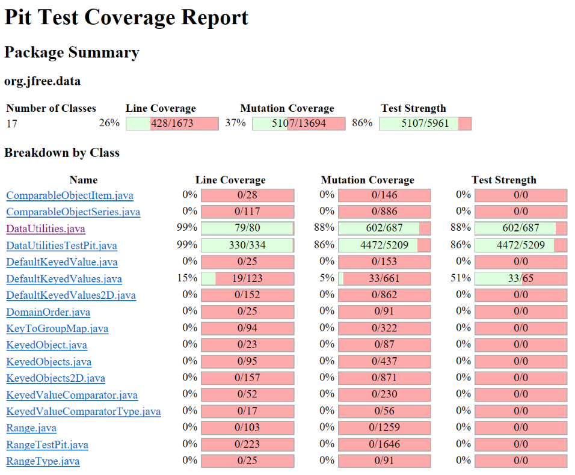

**SENG 438 - Software Testing, Reliability, and Quality**

**Lab. Report \#4 – Mutation Testing and Web app testing**
| Group \#: 13     |  |
| -------------- | --- |
| Student Names: |     |
| Tien Dat Johny Do         |     |
| Tommy Dinh              |     |
| Stuart Johnstone               |     |
| Sina Tavakol Moghaddam              |     |

# Introduction
The main objective of this laboratory assignment was to gain familiarity with the fundamental concepts of mutation testing and GUI testing, as previously presented in the lectures. In pursuit of this goal, our group opted to employ the PIT testing tool within Eclipse to evaluate mutation coverage. In Part 2 of the lab, we employed the Selenium IDE extension on our Google Chrome browser to further enhance our comprehension of this essential tool. In addition to our primary focus on mutation testing, we recognized the importance of conducting GUI testing to automate test cases centered around user interfaces. Through these exercises, we endeavored to detect potential weaknesses within the original source code, identifying areas that may not have been thoroughly tested.

# Analysis of 10 Mutants of the Range class 
1. #### getUpperBound()Mutation :  (Return this.upper)

Negated double field upper -> Killed

This mutation will mutate this.upper field before it is returned. For example the upper bound is 1 it will be negated to -1 and then returned, but through our original test cases we have a test case that handles that mutation as well as the range constructor testing the lower and upper bound before going through with any method.

2. #### getLength() Mutation : (return this.upper - this.lower)

Incremented (a++) double field upper → SURVIVED

This mutation will mutate this.upper and post increment it by adding 1. This mutation does not get killed through our original test cases. We did not take into consideration the increment of a local variable.member variables for this mutation within this method.

3. #### expandToInclude(Range range, double value) if(range ==null)

removed conditional - replaced equality check with true → KILLED

This mutation will mutate the if statement to be true which is covered within our original test case just by inputting an integer number range. The guarded statement will always execute.

4. #### intersects() Mutation : (if b0 <= this.lower) 

greater than to greater or equal → KILLED

This mutation will mutate the if statement to if (b0>=this.lower) which is covered within our test cases meaning we have already made a test case where b0 is larger than or equal to this.lower which means this mutation was killed

5. #### constrain(double value) if (value > this.upper) Mutation :

Less or equal to equal → KILLED

This mutation will mutate the if statement to if(value<=this.upper) which is also covered in our original test cases meaning we have made a test case were the value is bigger of equal to this.upper, meaning this mutation was killed. 

6. #### combine(Range range1, Range range2) : Mutation if (range1 == null)

Mutation : negated conditional → KILLED

This mutation will mutate the if condition to if(range1 !=null). This mutation will test if the range1 is a number. Our original test cases killed this mutation by using integer numbers as inputs for the range.

7. #### combineIgnoringNaN(Range range1, Range range2) : Mutation if(range1.isNaNRange())

equal to less or equal → SURVIVED

This mutation will turn the if statement to be if it’s less than “not a number” or equal to “not a number”. This test case is only possible if the number is not a number which is not covered in our original test. As well as to be less than “not a number” cannot be determined meaning this mutation will survive.

8. #### min(double d1, double d2): Mutation if (Double.isNaN(d1)) 

equal to greater or equal → SURVIVED 

This mutation will turn the if statement to if(d1 >= to NaN). This test case is similar to the one above where we cannot determine a value that is greater than “not a number” meaning this mutation survived in our oriignal test suite. 

9. #### expandToInclude(Range range, double value): Mutation if (value < range.getLowerBound())

changed conditional boundary → SURVIVED

This mutation will turn the if condition to if(value <=range.getLowerBound()). In our original test case we did not test any values in which the value equaled the lower bound meaning that this mutation survived.

10. #### isNaNRange() : Mutation return Double.isNaN(this.lower) && Double.isNaN(this.upper)

removed conditional - replaced equality check with true → SURVIVED

This mutation will turn this.lower and this.upper to “not a number”. This mutation was not covered by our original test cases by not testing any lower or upper bound that is not a number. 

# Report all the statistics and the mutation score for each test class

## Original Range Mutation Test Statistics 

### Original DataUtilities Mutation Test Statistics

# Analysis drawn on the effectiveness of each of the test classes

## New Range Mutation Test Statistics

Our Mutation score went from 57% to 67% which is a 10 percent increase from the orignal test case suite for the Range class. 

## New DataUtilities Mutation Test Statistics

Our Mutation score went from 78% to 88% which is a 10 percent increase from the orignal test case suite for the DataUtilities class. 

In brief, our group was able to achieve a 10 percent increase on both classes meaning we solved a portion of the survived mutants. We added quite a few more test cases in order to kill the mutations in the source code. In order to do that, our group reviewed all of the mutation lines and kill some mutations by method discussed further in the report. 

# A discussion on the effect of equivalent mutants on mutation score accuracy

Equivalent mutants refer to mutations that do not alter the behavior of the original code, and thus produce the same output as the unmutated code. These mutants do not affect the accuracy of the mutation score because they have the same behavior as the original code.

However, the presence of equivalent mutants may lead to an overinflated mutation score, as they are counted as additional mutations that have been killed. This can create a false impression that the code has been more rigorously tested than it actually has.

To ensure that the mutation score precisely reflects the quality of testing, it is necessary to exclude equivalent mutants from the score.

# A discussion of what could have been done to improve the mutation score of the test suites

In our case, our group could have still made more test cases in order to get a better mutation score. As well our group could make more efficient test cases by using a variety of data sets from Not a number inputs, invalid inputs, negative inputs, positive inputs, valid inputs, just to list a few. Another stategy our group made was to try to deal with any if/ branch statements due to these mutations being easier to create test cases for. Lastly, we found that boundary condition changes were also a focus in order to increase our mutation testing score. In brief, our group focused on the branch mutations for this assignment, but in order to keep on increasing the mutation score further would be to focuse on increment/decrement as well as negation mutations. Below we have a comprehensive list of mutations we have killed in Range and DataUtilities.

## Range Class :
With the new test cases we killed these mutations :

### getCentralValue():
* Line 143, replaced double return with 0.0d
* Line 143, replaced double addition with modulus

### intersects(double, double):
* Line 157, changed conditional boundary
* Line 157, greater than to greater or equal
* Line 157, post increment double field lower
* Line 157, post decrement double field lower
* Line 157, Pre increment double field lower
* Line 157, Pre decrement double field lower
* Line 158, changed conditional boundary
* Line 158, less or equal to less than 
* Line 158, ore increment double local variable number 3
* Line 158, pre increment double filed lower
* Line 158, pre decrement double local variable number 3
* Line 158, pre decrement double field lower
* Line 161, changed conditional boundary
* Line 161, removed conditional - replaced comparison check with true
* Line 161, negated double local variable number 1 
* Line 161, Greater or equal to greater than
* Line 161, greater or equal to equal
* Line 161, pre increment double field upper 

### intersects(Range):
* Line 176, replaced boolean return with true

### min():
* Line 274, negated conditional 
* Line 274, removed call to java/lang/Double::isNaN
* Line 274, equal to greater than
* Line 274, Equal to greater or equal 
* Line 275, replaced double return 0.0 for org/jree/data/Range::min
* Line 275, replaced return of double value with -(x+1) for org/jfree/data/Range::min
* Line 275, negated double local variable number
* Line 275, pre increment double local variable number 0
* Line 275, pre decrement double local variable number 0

### scale():
* Line 410, changed conditional boundary
* Line 410, substituted 0.0 with 1.0
* Line 410, Substituted 0.0 with 1.0
* Line 410, substituted 0.0 with 1.0
* Line 410, greater or equal to greater than
* Line 410 Greater or equal to not equal 

### shiftWithNoZeroCrossing():
* Line 387, removed conditional - replaced comparison with true
* Line 387, negated double local number 0
* Line 387, less or equal to greater than
* Line 387, less or equal to greater or equal
* Line 387, less or equal to equal
* Line 390, changed conditional boundary
* Line 390, substituted 0.0 with 1.0
* Line 390, negated conditional
* Line 390, removed conditional - replaced comparison check with true
* Line 390, substituted 0.0 with 1.0
* Line 390, substitute 0.0 with 1.0
* Line 390, greater or equal to less than
* Line 390, greater or equal to greater than
* Line 390, greater or equal to not equal
* Line 390, post increment double local variable number 0
* Line 390, pre increment double local variable number 0

### equals(Range):
* Line 430, removed conditional - replaced equality check with false
* Line 430, equal to less or equal
* Line 433, removed conditional - replaced equality check
* Line 433, equal to less or equal

### hashCode();
* Line 460, Removed call to java/lang/Double::doubleToLongBits
* Line 461, substituted 32 with 33
* Line 461, replaced unsigned shift right with shift left
* Line 461, replaced XOR with AND
* Line 461, negated long local variable number 1
* Line 461, substituted 32 with 1
* Line 461, substituted 32 with 0
* Line 461, substituted 32 with -1
* Line 461, substituted 32 with 31
* Line 462, removed call to java/lang/Double::doubleToLongBits
* Line 463, substituted 39 with 30
* Line 463, Substituted 32 with 33
* Line 463, Replaced unsigned shift right with shift left
* Line 463, Replaced XOR with AND
* Line 463, Replaced integer addition with subtraction
* Line 463, Negated integer local variable number 3 
* Line 463, Negated long local variable number 1 
* Line 463, Replaced integer operation with first meber
* Line 463, Replaced integer operation by second number
* Line 463, Replaced integer addition with subtraction
* Line 463, Replaced integer addition with multiplication
* Line 463, Substituted 29 with 1
* Line 463, Substituted 32 with 1 
* Line 463, Substituted 29 with 0
* Line 463, Substituted  32 with 0
* Line 463, Substituted 29 with -1
* Line 463, Substituted 29 with -1
* Line 463, Substituted 29 with -29
* Line 463, Substituted 32 with -32
* Line 463, Substituted 29 with 30
* Line 463, Substituted 32 with 33
* Line 463, Substituted 29 with 28
* Line 463, Substituted 32 with 31
* Line 463, Pre decrement long local variable 1
* Line 464, replaced int return with 0 for org/jree/data/Range::hashCode
* Line 464, negated integer local variable number 3

### constrain():
* Line 188, negated double local variable number 1
* Line 188, post increment double local variable number 1
* Line 188, post decrement double local variable number 1
* Line 189, post increment double local variable number 1
* Line 189, post decrement double local variable number 1
* Line 189, pre increment double local variable number 1
* Line 189, pre decrement double local variable number 1
* Line 190, post increment double local variable number 1
* Line 190, pre increment double local variable number 1
* Line 190, pre decrement double local variable number 1
* Line 193, negated double field lower
* Line 193, pre increment double local variable number 1

#### **getCentralPositiveValue():**
The purpose of this test case was to verify the accuracy of the getCentralValue() method, which is located in the Range class. To accomplish this, we instantiated a Range object with values ranging from 2 to 6 and applied the method to determine its central value. Our verification process involved utilizing an assertEquals statement to confirm that the method correctly returned the expected result, which in this case, was 4

#### **intersectsLowerBoundEqualsUpperBound():**
The purpose of this particular test was to examine the upper boundary condition of the intersects(double, double) method, which can be found in the Range class. To achieve this, we first instantiated a Range object that had a range spanning from 2 to 6. We then created two double values, lower = 0 and upper = 2 (which happened to match the lower bound of the Range object). These values were utilized to assess whether there was any overlap between our Range object and the given values. In order to ensure that the method was accurately determining the absence of an intersection, despite the Range object's lower bound matching the lower value, we implemented an assertFalse statement. This test proved to be quite effective at identifying errors in the code, as it revealed that the upper bound of the range was not being appropriately checked for intersections.

#### **intersectsUpperBoundEqualsLowerBound():**
The purpose of this test was to evaluate the lower boundary condition of the intersects(double, double) method in the Range class. To do so, we created a Range object with a range spanning from 2 to 6, and defined two double values, lower = 6 (which coincides with the upper bound of the Range object) and upper = 8. These values were then used to assess whether there was any intersection between our Range object and the given values. In order to verify that the method accurately recognized the lack of an intersection, despite the Range object's upper bound matching the upper value, we employed an assertFalse statement. This particular test proved to be highly effective at identifying issues in the code, as it revealed that the boundaries of the range were not being properly assessed for intersections.

#### **intersectsLowerBound():**
The prupose of this test was to assess the lower boundary condition of the intersects(double, double) method in the Range class. To execute this test case, we generated a Range object that spanned from 2 to 6, and generated a boolean that would record the outcome of an intersection with lower = 2 and upper = 2. Following the calculation of this value, we utilized the assertFalse functionality to determine whether the boolean output was false, as there was no intersection between the given range and the two points. This test proved effective in detecting a mutant that compared the lower value of the Range object with the value of lower, as we had not initially evaluated this lower boundary value.

#### **intersectsDecrementMutation():**
The purpose of this test was to eliminate a prefix decremental mutation that may arise within the intersects(double, double) method of the Range class. Initially, a Range object was created with a range from 2 to 3, and the code was subsequently implemented to verify if this range intersected with the given points of lower = 2 and upper = 3. As these values matched the range itself, an intersection was present. In order to address a specific mutant that was situated on line 158, wherein the upper bound was decremented, we sought to eliminate this mutant by conducting this test. This particular mutation would have set the value of upper to 2, resulting in a false outcome since upper would match the lower bound of the Range object. However, the expected result in this instance should be true, as the range does indeed intersect. Therefore, this test was able to eliminate this particular mutant.

#### **doesNotIntersectsRange():**
The purpose of this test was to verify the intersects(Range) method in the Range class. To achieve this, we generated two Range objects: one with a range from 2 to 6, and another with a range from 8 to 10. We then utilized the assertFalse feature to assess whether the method would return a false boolean value, as there was no intersection between the two Range objects and the given values. This test proved effective in detecting several mutants that had not previously been identified, as we had not previously evaluated the scenario in which two Range objects did not intersect.

#### **minNaNLowerBound():**
The purpose of this test was to verify the functionality of the min(double, double) method in the Range class. Specifically, we utilized the combineIgnoringNaN function to evaluate the behavior of the min function. Our focus was on testing the lower bound of the resultant Range object that was determined by the method. We employed an assertEquals assertion to confirm that the method was indeed returning the minimum value between NaN and 2. Through this test, we were able to detect and eliminate several additional mutants that had not previously been evaluated. 

#### **scaleZeroFactor():**
The purpose of this test was to verify the functionality of the scale(Range, double) method in the Range class. We initialized a Range object with a range of 2 to 6 and called the method with a scaling factor of 0. Subsequently, we utilized an assertEquals assertion to ensure that the lower bound of the Range object returned the expected value of 0. By conducting this test, we were able to detect and eliminate several additional mutants that had not previously been evaluated. This was primarily due to a lack of testing the method in scenarios where the scaling factor was zero.

#### **shiftWithNoZeroCrossingValueEqualsZero():**
The purpose of this test was to verify the accuracy of the shiftWithNoZeroCrossing(double, double) method in the Range class. We initialized a Range object with a range of 0 to 0, and invoked the shift(Range, double, boolean) method, which in turn called the helper method shiftWithNoZeroCrossing(double, double) with allowZeroCrossing set to false. We utilized an assertEquals method to ensure that the upper bound of the Range object returned the expected value after being shifted by 200. By executing this test, we were able to detect and eliminate additional mutants that were previously undetected, specifically those that occurred when the upper bound of the Range object was set to 0.

#### **shiftWithNoZeroCrossingValueIsNegative():**
The purpose of this test was to verify the correctness of the shiftWithNoZeroCrossing(double, double) method in the Range class. To do so, we created a Range object with a range from -6 to -2 and called the method shift(Range, double, boolean) with a shifting factor of -200 and allowZeroCrossing set to false, which in turn called the helper method shiftWithNoZeroCrossing(double, double). We used assertEquals to check if the upper bound of the Range object returns the expected value after the shift operation. This test case was successful in killing some additional mutants because we had not previously tested the method with a negative upper bound and a negative shifting factor.

#### **equalsDifferentLowerBound():**
The purpose of this test was to verify the correctness of the equals(Object) method in the Range class. Specifically, we instantiated a Range object with a range from 2 to 6 and utilized an assertFalse statement to confirm that it does not equal another Range object with a range from 4 to 6. This is because the lower bounds for both Range objects are different. By doing so, this test was successful in eliminating some additional mutants that were not previously addressed, particularly those that involve comparing two Range objects with different lower bounds.

#### **hashCodeTestValid():**
The purpose of this test was to verify the correctness of the hashCode() method in the Range class. A Range object with a range from 2 to 6 was created, and an assertEquals was used to check if the object's hashcode was correct. By covering the tests for hashCode(), this test was able to kill additional mutants that were not previously detected.

#### **constrainDecrementMutation():**
The purpose of this test is to detect a prefix decremental mutation in the constrain(double) method of the Range class. To accomplish this, we first create a range from 1 to 4 and then call the method to find the closest value to 1. Since the closest value is 1, the method should return 1. However, for this particular mutant, the local variable "result" takes on the value of 1 and is then decremented to 0. Despite the fact that the correct value is 1, the method returns 0 due to the mutation. This would cause the assertion with the expected value of 1 to fail. As a result, this mutant was successfully killed by this test case.

#### **constrainBelowLowerRange():**
The purpose of this test is to detect a post incremental mutation in the constrain(double) method of the Range class. To accomplish this, we first create a range from 2 to 6 and then call the method to find the closest value to 1. Since the closest value is 2, the method should return 2. However, for this particular mutant, the local variable "result" takes on the value of 2 and is then incremented to 3. Despite the fact that the correct value is 2, the method returns 3 due to the mutation. This would cause the assertion with the expected value of 2 to fail. As a result, this mutant was successfully killed by this test case.

#### **constrainAboveLowerRange():**
The purpose of this test is to detect a post incremental mutation in the constrain(double) method of the Range class. To accomplish this, we first create a range from 2 to 6 and then call the method to find the closest value to 7. Since the closest value is 6, the method should return 6. However, for this particular mutant, the local variable "result" takes on the value of 6 and is then decremented to 5. Despite the fact that the correct value is 6, the method returns 5 due to the mutation. This would cause the assertion with the expected value of 6 to fail. As a result, this mutant was successfully killed by this test case.

## DataUtilities Class :
Our group added 8 more test cases in order to increase our Mutation Coverage from 78% to 88%. Our group found that mutation testing for conditional test were easier to find and write test cases for. We added 8 more test cases to kill the following Mutations:

### Calculate ColumnTotal Method : 
* Line 155, line 19, Mutation 1 : Negated integer local variable number 7 
* Line 155, line 19, Mutation 2 : Greater or equal to equal 
* Line 155, line 19, Mutation 3 : Incremented (a++) integer local variable number 5
* Line 157, line 7, Mutation 1 : Removed conditional - replaced equality check with true 

### CalculateRowTotal Method :
* Line 206, line 19, Mutation 1 : Line Negated integer local variable number 7 
* Line 206, line 19, Mutation 2 :Greater or Equal to Equal 
* Line 206, line 19, Mutation 3 :Increment (a++) integer local variable number 5

### Clone Method : 
* Note since we had to have a green test suite with no failures, our group had to comment out the test cases from clone and create new ones *
* CloneNullCase
* CloneNegative
* ClonePositive

### CalculateColumnTotal
#### **calculateColumTotalRowOutofRange()** 
Parameters : (Values2D, int column, int [ ] row)

In this test we tested when the condition of if(row<rowCount) condition where we would make this condition mutate false by making row[] = 100 and rowCount being 1 meaning row>rowCount. Meaning the valid row we want to check is out of range.

#### **calculateColumnTotalRowLower()** 
Parameters : (Values2D, int column, int [ ] row)

In this test we tested when the condition of if(row<countCount) condition where we would make this condition mutate false by making row[] = 1 and rowCount being 1 meaning row =rowCount. Meaning the valid row we want to check is equal to the row.

#### **calculateColumnTotalNull()**  Parameters : (Values2D, int column, int [ ] row)

In this test we tested when the condition of if (n !=null) condition where we would make this condition mutate false by making n = null in two different rows meaning that n is null in more than one input. 

### CalculateRowTotal

#### **calculateRowTotalColLower()**
Parameters : (Values2D, int row, int [ ] column)

In this test we tested when the condition of if (col < colCount) where we would make this condition mutate false by making column[ 1 ] and col = 1 meaning that col = colCount and making this false.

#### **calculateRowTotalNull()**
Parameters : (Values2D, int row, int [ ] column)

In this test we tested when the condition of if (n !=null) condition where we would make this condition mutate false by making n = null in two different rows meaning that n is null in more than one input. 

### clone()

#### **cloneNullCase()**

In this test we tested when the condition of if(source[i] != null) where we would make this condition mutate false by making all the inputs of the source array null. Meaning that source[i] == null making this condition false.

#### **cloneNegative()**

In this test we tested when the condition of if(source[i] != null) where we would make this condition mutate true by making all the inputs of the source array negative. Meaning that source[i] != null making this condition take in the negative inputs. 

#### **clonePositive()**

In this test we tested when the condition of if(source[i] != null) where we would make this condition mutate true by making all the inputs of the source array positive. Meaning that source[i] != null making this condition take in the positive inputs. 

# Why do we need mutation testing? Advantages and disadvantages of mutation testing

Mutation testing is a technique used in software testing to evaluate the effectiveness of test cases by introducing artificial defects, called mutants, into the codebase. The primary purpose of mutation testing is to measure the quality of test cases by verifying their ability to detect the artificial mutations, thereby identifying weak spots in the code that may not have been adequately tested.

Advantages of Mutation Testing:

1. Mutation testing is useful in determining the quality of the test cases by evaluating their ability to detect the introduced artificial defects.

2. By identifying areas of weakness in the code, mutation testing can help improve the overall quality and reliability of the software, thereby increasing confidence in the codebase.

Disadvantages of Mutation Testing:

1. Mutation testing involves introducing multiple artificial defects into the codebase, which can be a time-consuming process, especially for larger codebases.

2. The presence of a mutation does not necessarily indicate a bug in the code, and the absence of mutations does not guarantee the absence of bugs. Therefore, it is essential to interpret the results of mutation testing with care

# Explain your SELENUIM test case design process

Steps :

1. Familiarize with the Amazon Website

2. Explore different functions and record instructions to get to the function

4. Write test cases for each function listed above in Selenium IDE

5. Execute the test cases

Our group decided to use the Amazon website in order do do the selenium test cases. First we wanted to get familiar with the website by exploring the functions. We had to record a few steps on how to get to each functionality which is part of our test case design process. We then chose 4 functionalities of the website to make our test cases around. Firstly we explored the login function making one test case with a valid login and one with invalid login to make sure the function works. Secondly, we looking at the purchasing/Add to cart functionality where we first searched for an iteam then added to the cart. In addition, we made another test case to remove the item from the cart. Thirdly we wanted to check the functionality of language change on the website by first selecting to change the language of the website to french and another test case to change it back to english. Furthermore we explored the functionality of changing departments on the website by filtering the search to amazon devices and we create another test case to change the department back to all. Lastly, we added a test case to go back to the home page through pressing the amazon button at the top of the page. Our group made these test cases through our exploratory phase familiarizing ourselves with the website. 

# Explain the use of assertions and checkpoints
To ensure the accuracy and reliability of software being tested, software testers frequently use assertions and checkpoints.

Assertions are code statements that validate if a specific condition is true or false. They are employed primarily to verify that the actual result of a test matches the anticipated result. If an assertion fails, it indicates a problem with the software and that the test has failed.

Checkpoints are a type of assertion that compares the current state of the software to a predetermined set of expected results. They are typically employed to guarantee that the software is operating correctly at specific points throughout the testing process.

# how did you test each functionaity with different test data

To ensure the thoroughness of our testing, we evaluated each functionality using various types of data, including both valid and invalid sets. For instance, we tested the login function using a set of data that was considered valid for login purposes to assess the functionality, and the system responded by granting the user access. Subsequently, we tested the same function using invalid data, such as attempting to sign in with an incorrect password, which produced an error message.

# Discuss advantages and disadvantages of Selenium vs. Sikulix

Both Selenium and SikuliX are popular testing frameworks utilized for automated testing of web applications. The following are some advantages and disadvantages of each framework:

Advantages of Selenium:

1. It supports a wide variety of web browsers, including Chrome, Firefox, Safari, Edge, and Internet Explorer, making it ideal for testing web applications across multiple platforms.

2. Selenium is a robust open-source tool that offers a framework for automating web application testing, and it benefits from a vibrant community of developers who continually contribute to its development and maintenance.

Disadvantages of Selenium:

1. Learning and mastering Selenium can be difficult, particularly for individuals with minimal to no programming experience.
2. Selenium is primarily designed for testing web applications and is not suitable for desktop application testing.

Advantages of SikulX:

1. With support for multiple scripting languages, including Python and Java, SikuliX is a flexible and versatile tool for automating desktop application testing.

2. SikuliX is capable of using image recognition to automate desktop application testing, which makes it well-suited for testing applications that do not have adequate automation support.

Disadvantages of SikulX:

1. SikuliX is mainly created for testing desktop applications and lacks support for testing web applications.

2. SikuliX's image recognition feature can be unreliable and prone to errors, especially when the test environment is not consistent.

# How the team work/effort was divided and managed
To ensure that everyone in our group gained experience in Mutation testing and GUI testing, we divided the tasks among ourselves where it would be pair testing. One set of groups did Range and a couple Selenium test cases and another group did DataUtilities and a couple Selenium test cases. After a group has finished getting at least 10% on the test class they were assigned they sent it to the repository for the other group to check over and cross-check. For the selenium we would send it out to our repository and execute the test case in our browser to understand how each test case worked. Pairs were Tommy and Tien Dat and the other pair was Stuart and Sina. We would then compile all our information from the mutation testing and GUI testing in the lab write up in the respective places. 

# Difficulties encountered, challenges overcome, and lessons learned
One of the greatest difficulties encountered in this lab is how long it took for the mutation testing using PIT Mutation Testing. Running PIT each time took around 3-5 minutes on our machines which is not ideal when trying to test source code. Not only was PIT very time consuming, but also very resource demanding, especially with the Memory of our computers. We were able to overcome these challenges by deleting the JFree Chart packages from the Java project since JFree Chart was not the part of the program that we were testing. By doing so, decreased the test time drastically as well as less demand on computer resources. The lesson learned here was that Mutation testing is a great way to increase the quality of your code, but also very demanding on time and resources which is why it is important to know what you are testing and to find if there are any ways to make the testing process easier.

# Comments/feedback on the lab itself
Assignment 4 was a great way to introduce us into the world of GUI and Mutation testing. The assignment outline gave clear indications of how to use each tool. The only drawback of this lab was the initial setup for the Mutation testing and getting all of JFree_Lab4 working properly by ensuring that all of the external libraries were added as well as the proper external libraries from the previous assignment.
